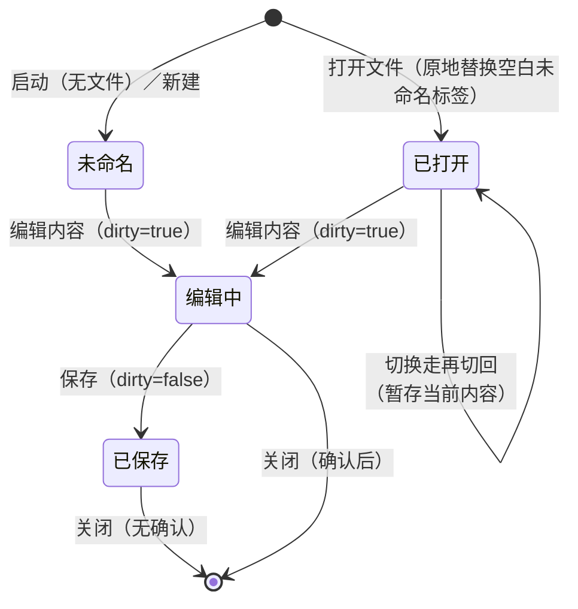
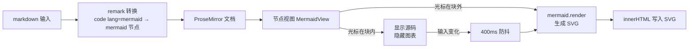
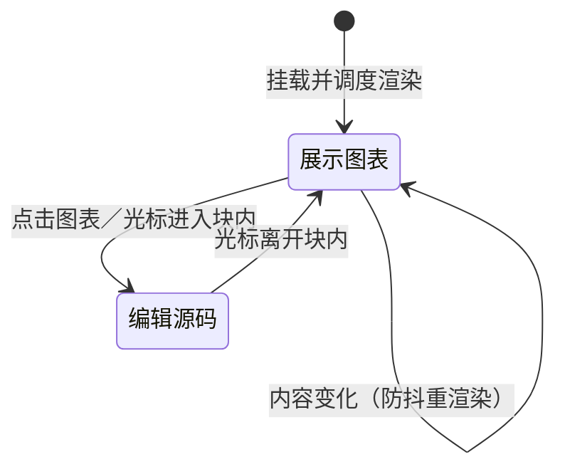
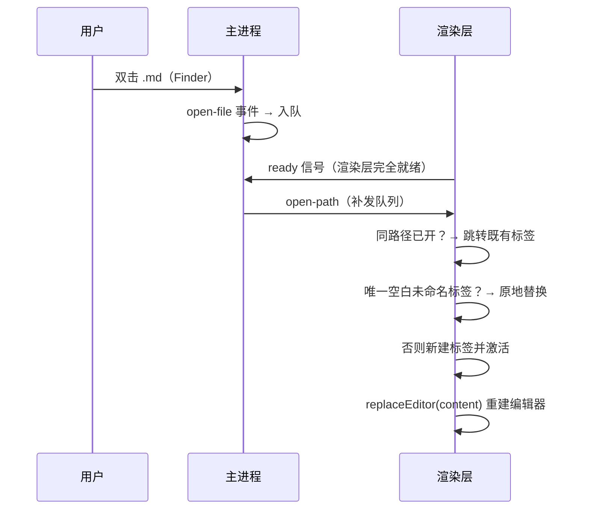
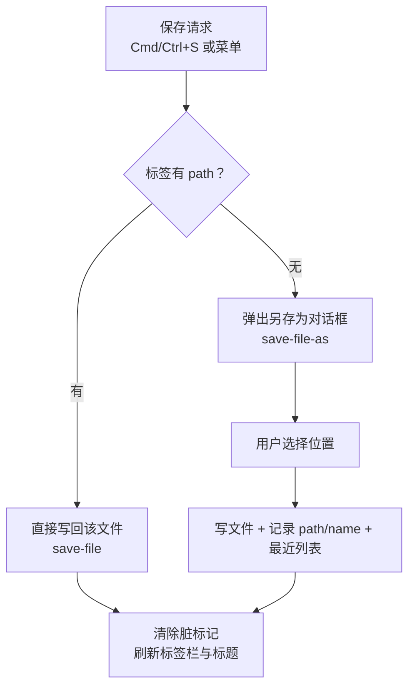
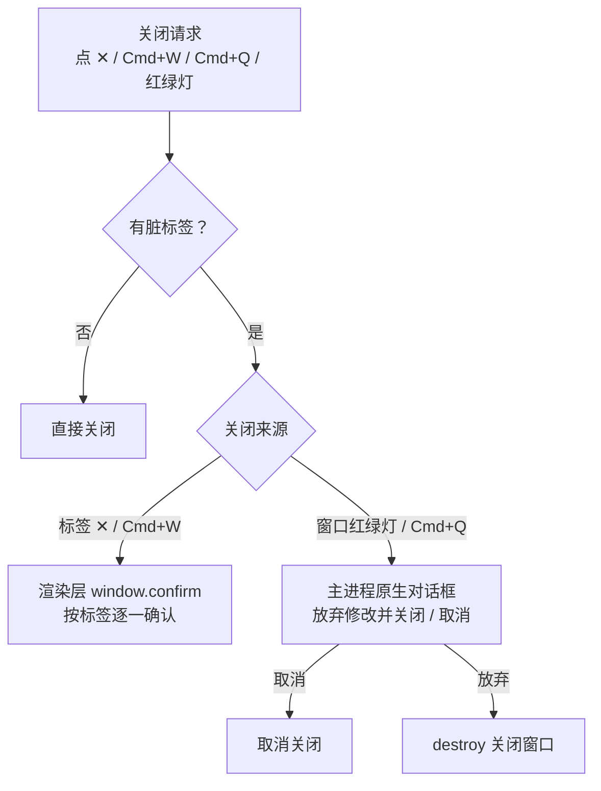

# TMD 详细设计

> 版本：1.1　作者：chiangyang　更新：2026-09-12
> 前置阅读：[架构设计](架构设计.md)。本文描述各模块的内部设计、关键算法与数据结构。

## 1. 数据结构

### 1.1 标签页 DocTab（src/tabs.ts）

应用的核心状态：一个标签对应一份在编辑的文档。

```typescript
interface DocTab {
  id: string          // 自增 id：tab-1, tab-2, ...
  path?: string       // 关联磁盘文件的绝对路径；未保存过的新文档为 undefined
  name: string        // 展示名（文件名或"未命名.md"）
  markdown: string    // 打开/保存时的基准内容（最后一次与磁盘同步的内容）
  dirty: boolean      // 未保存修改标记（由编辑事件置位，保存/打开时清除）
  recovered?: boolean // 启动时从恢复副本还原的内容，不可被"打开文件"原地替换
  scrollTop?: number  // 切走时的滚动位置（切换回来时恢复）
}
```

**脏标记原则**：`dirty` 只由 milkdown 的 `markdownUpdated` 事件（真实编辑）置位，由保存/打开/替换清除。**禁止**用"序列化当前文档与基准比对"的方式判定——序列化会规范化文本（去尾随空格、统一列表标记），未修改的文档也会被判为已修改（此 bug 曾导致关闭空文档误弹确认框）。

### 1.2 语言包（src/locales/*.json）

MarkText 式嵌套键结构，按界面区域分类：

```json
{
  "toolbar": { "outline": "大纲", "find": "查找", ... },
  "menu":    { "file": "文件", "open": "打开…", ... },
  "dialog":  { "closeConfirm": "「{name}」有未保存的修改，确定关闭吗？" }
}
```

- 取词：`t('dialog.closeConfirm', { name })`，`{xxx}` 为参数占位
- 新增语言 = 新增 `src/locales/xx.json`，无需改代码
- Electron 菜单文案由渲染层 `menuLabels()` 导出、经 IPC 交主进程重建（渲染层是语言的唯一事实源）

## 2. 标签页模块（src/tabs.ts）

### 2.1 状态机



### 2.2 关键规则

| 规则 | 设计 |
|---|---|
| 命名去重 | 未命名.md → 未命名-1.md → 未命名-2.md；在已打开标签中查重，词干随语言包 |
| 打开同路径文件 | 跳转到既有标签，不重复开 |
| 打开文件替换空标签 | 替换任意"空白新建标签"（无路径、未脏、内容为空、**非恢复内容**），避免残留；启动恢复出的未保存内容带 recovered 标记，不会被覆盖 |
| 关闭最后标签 | Electron：关闭窗口（应用留后台，Dock 重开）；浏览器：退回新建空白页 |
| 关闭确认 | `tab.dirty` 为真时弹确认（渲染层确认框用于标签；窗口级关闭走主进程原生对话框） |
| 切换标签 | 旧标签暂存 `currentMarkdown()`，重建编辑器载入目标内容（Mermaid 随之重渲染） |
| 恢复副本生命周期 | 编辑即写 localStorage（崩溃兜底）；保存成功且无其他脏标签时清除；干净退出时清除——已保存的内容不会在下次启动"复活"为未命名标签 |

## 3. Mermaid 实时渲染（src/mermaid.ts）

### 3.1 渲染管线



### 3.2 节点视图状态



### 3.3 关键算法

**防抖 + 序号守卫**：每次渲染请求 `++renderSeq`；异步 `mermaid.render` 返回后若 `seq !== renderSeq` 说明已有更新请求，直接丢弃过期结果——连续快速输入不会闪旧图，也不会错写容器。

**错误兜底**：`mermaid.render` 抛异常时**清空 renderArea**（不保留旧 SVG）并显示具体错误信息（与 Typora/Obsidian 行为一致，避免用户误以为旧图是当前语法的渲染结果）；语法改对后自动恢复。冷启动时 mermaid 的图表类型模块按需懒加载，首次渲染可能抛 "No diagram type detected"，按 400/800/1200ms 自动重试至多三次。

**编辑态判定**：编辑态由"光标选区是否落在节点内容范围内"驱动，选区变化通过一个全量装饰器插件感知（ProseMirror 会在装饰变化时回调节点视图的 `update`），视图据此切换"显示图表 / 显示源码"两类 DOM 的可见性。

**输入规则**：`/^```mermaid$/` 命中后删除触发文本并将所在段落 `setBlockType` 为 mermaid 节点，光标自然落在空节点内进入编辑态。

## 4. 文件打开 / 保存流程

### 4.1 打开文件时序



> `ready` 信号是关键设计：渲染层完全装配完成后才接收打开请求，消除"启动"与"文件打开"的时序竞态（此前会产生两个编辑器实例）。
>
> **无窗口兜底**：应用留后台（窗口已全部关闭）时双击 .md，主进程检测到无窗口（或窗口已销毁）会自动 `createWindow()` 重建窗口承载文件，并 `app.focus({ steal: true })` 带到前台——不再依赖用户点 Dock 触发 activate 才补发。**preload 缓冲**：`open-path` 消息可能早于渲染层注册处理器到达（did-finish-load 早于 boot 装配完成），preload 先缓冲、注册后再补发，消息不丢失。

### 4.2 保存流程



浏览器降级：无 path 时直接触发 .md 下载。

## 5. 查找替换（src/find.ts）

- 匹配：在所有文本节点内做大小写不敏感查找，逐节点收集 `{from, to}` 区间（不跨节点匹配）
- 高亮：ProseMirror 插件的 `decorations` 属性按匹配区间生成内联装饰（普通命中 / 当前命中两种样式）；查询变化后派发一个仅带 meta 的空事务触发装饰重算
- 跳转：`index ± 1` 循环取模，`TextSelection` 定位并 `scrollIntoView`
- 替换单个：`tr.insertText(替换词, from, to)` 后重新收集匹配
- 全部替换：按 `from` **从后往前**依次 insertText（避免位置偏移），单事务一次完成
- 源码模式：不启用本模块，使用 CodeMirror 自带搜索面板

## 6. 源码模式（src/sourcemode.ts）

- 进入：取当前 markdown 全文 → 销毁所见即所得编辑器 → 在 `#src-editor` 挂载 CodeMirror（basicSetup + markdown 语法）
- 退出：取 CodeMirror 全文 → 重建所见即所得编辑器（mermaid 等随内容重新渲染）
- 快捷键 Cmd/Ctrl+E；查找交给 CodeMirror 内建搜索面板（`⌘F` 不拦截）

## 7. 导出（src/export.ts）

- **HTML**：markdown-it 渲染正文（`html:false` 防 XSS；mermaid 围栏转为 `<pre class="mermaid">` 由 CDN 脚本渲染；KaTeX 走 CDN 自动渲染）；样式内联；Electron 下走 `export-as` 保存对话框，浏览器下降级为下载
- **PDF**：Electron 下调用 `webContents.print`（系统打印对话框可选"存储为 PDF"）；浏览器下 `window.print()`

## 8. 粘贴图片（src/paste-image.ts）

ProseMirror `handlePaste`：检测剪贴板中的图片文件 → 单张 > 5MB 忽略并告警 → 按设置面板配置的存储策略插入 image 节点：

- **inline（默认）**：FileReader 转 data URL 内联进文档，不要求文档已保存
- **assets**：经 IPC `save-image` 写入文档同目录 `assets/` 文件夹，文档中保存相对路径（`assets/xxx.png`，便于迁移与 GitHub 展示）；要求文档已保存过，未落盘或写入失败时自动降级 inline

相对路径的"显示解析"由 src/image-resolver.ts 负责：文档内容里始终保存相对路径，打开/切换标签时按文档所在目录解析为可显示的 src。

## 9. 多语言（src/i18n.ts）

- 语言检测顺序：localStorage 覆盖 → 系统语言（zh* → zh-CN，其余 → en）
- 三类替换：`t(path, params)` 动态取词；`data-i18n` / `data-i18n-title` / `data-i18n-placeholder` 静态 DOM 批量替换；`menuLabels()` 导出菜单文案交主进程重建菜单
- 菜单重建时保留自动保存勾选状态（主进程持有）

## 10. 关闭保护链路



> 标签级确认必须用渲染层 confirm；窗口级关闭确认必须用主进程原生对话框——渲染层 confirm 在 Electron 关闭流程中会静默失效（历史 bug：导致窗口无法关闭）。

## 11. 目录块（src/toc.ts）

**存储格式**：目录在 Markdown 中存为 HTML 注释包裹的真实链接列表（注释与列表间留空行），外部渲染器（GitHub / VS Code）中注释不可见、链接可见可点：

```markdown
<!-- TOC -->

- [标题一](#标题一)
  - [子标题](#子标题)

<!-- /TOC -->
```

**设计要点**：

| 环节 | 设计 |
|---|---|
| remark 解析 | Milkdown 的 remark-parse 关闭原始 HTML（`allowDangerousHtml: false` 安全默认），`<!-- TOC -->` 在 mdast 中是**内容为注释文本的段落**而非 html 节点；转换递归遍历，对 html / paragraph 节点取纯文本后按正则识别开闭标记，开标记前若混有其他正文则跳过；开闭标记之间的列表等节点整体合并为一个原子 `toc` 节点，闭标记缺失时容错吞到容器末尾 |
| 序列化 | `toc` 节点输出两个含注释文本的**段落**（不能输出 html mdast 节点——序列化器同样关闭危险 HTML）；`currentMarkdown()` 再经 `fillTocBlocks()` 用正则把占位区间替换为「开注释 + 空行 + 真实链接列表 + 空行 + 闭注释」，源码模式、保存、导出拿到的都是完整文本 |
| 转义兼容 | remark-stringify 会把行首 `<!` 转义为 `\<`（防 HTML 注入），填充与导出清理的正则均以 `\\?` 兼容可选前导反斜杠，避免文件中残留可见的 `\` |
| 节点视图 | 原子块（`atom: true`），光标不进入；方向键导航到块上产生 NodeSelection 后 Backspace 删除（`stopEvent()` 拦截块内点击事件，不转为块选中）；实例登记在模块级 Set，由 prose 插件在 `docChanged` 时统一 `refresh()` 重建列表（toc 节点自身不随标题变化，`update()` 不触发刷新） |
| 目录渲染 | 收集 1-3 级标题按层级缩进；无标题时显示空态提示；点击条目用 `TextSelection.near` 定位到对应标题并 `scrollIntoView()`（与大纲面板同一定位方式） |
| 锚点规则 | `slugify()` 为 GitHub 风格（小写、空白转连字符、去标点、保留中文）；同名标题按出现顺序加 `-1`/`-2` 后缀；链接文本中的 `\`、`[`、`]` 做转义。编辑器填充链接与导出 HTML 给标题加 id 共用同一规则，保证锚点一致 |
| 插入入口 | ① ⋯ 菜单「插入目录」（`insertToc(view)`：顶层段落整段替换，其他位置拆分段落插入）；② 输入规则：空行输入 `[TOC]` 回车自动转为目录块（仅顶层段落生效，列表项 / 引用内不触发） |
| 导出 HTML | markdown-it 以 `html:false` 渲染，注释会被转义成可见文本，故渲染前按行删除 TOC 标记行（保留中间链接列表正常渲染）；`heading_open` 规则为所有标题生成同规则 id 锚点。PDF 走编辑器现成 DOM，目录直接可见 |

## 12. 主题预设与自定义 CSS（src/theme-presets.ts）

主题体系分三层，全部落在 CSS 变量层，互不触碰编辑器实例：`style.css` 内建配色（基础）→ 主题预设（变量覆盖）→ 自定义 CSS（最高优先级，可引用前两层定义的任意变量）。

**主题预设**：`THEME_PRESETS` 定义四项——简约白（default，空覆盖）、深色（dark，即 html.dark 内建变量，选择它等于切深色模式）、羊皮纸（sepia）、护眼绿（green）。每个非空预设由 `presetCss()` 模板生成深浅两套变量覆盖：浅色限定 `html[data-theme-preset]:not(.dark)`，深色限定 `html[data-theme-preset].dark`——保证深浅模式各自正确覆盖且不串扰。

**注入方式**：预设写入 `<style id="theme-preset-style">`，自定义 CSS 写入 `<style id="custom-css-style">`（位于预设之后，同优先级下可覆盖预设）；变更即时生效，持久化经 store 的 `tmd:theme-preset` / `tmd:custom-css` 键，启动时 `restoreThemeStyles()` 恢复。

**设置面板统一主题列表**：原「主题外观」（深浅）与「主题预设」两栏合并为一个列表，映射规则——default+浅色 → 简约白；default+深色 → 深色；sepia/green → 各自预设项。选中深色项调用 `applyTheme(true)`，其余预设按各自浅色外观应用（当前为深色则切回浅色）。弹窗结构上标题栏与关闭按钮 `position: sticky` 吸顶，长内容滚动时保持可见。

## 13. 已知限制与后续计划

| 项 | 现状 | 计划 |
|---|---|---|
| 粘贴图片 | 已支持双策略：inline data URL（默认）/ assets 文件夹相对路径（设置面板切换，失败自动降级 inline） | 图床上传留待 v1.x |
| 查找替换 | 不跨节点匹配 | 支持 GB 跨节点与正则 |
| 任务复选框点击 | 已支持：点击列表项左侧复选框热区切换勾选（src/task-list.ts） | 已完成（ProseMirror 事务驱动，可 Cmd+Z 撤销，联动内容监听/自动保存） |
| 主题切换 | 已完成：mermaid 图表块原地重渲染，不重建编辑器（保住撤销历史/焦点/滚动位置） | — |
| 主题预设 / 自定义 CSS | 已支持：内置四项预设 + 设置面板自定义 CSS 文本域（见 §12） | 文件式主题目录（`~/.tmd/themes/*.css`）留待 v1.3 |
| 脚注 / front-matter | 未支持 | v1.x 引入对应 remark 插件 |
| 自动更新 | 已实现：electron-updater 双源（默认 Gitee，出错切 GitHub），发现新版本弹窗询问，不静默下载 | — |
